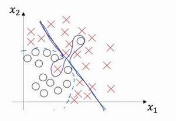

--------------------------------------------------------------
### 训练，验证，测试集（Train / Dev / Test sets）

内容涉及超参数调优，如何构建数据，以及如何确保优化算法快速运行，从而使学习算法在合理时间内完成自我学习。

在配置训练、验证和测试数据集的过程中做出正确决策会在很大程度上帮助大家创建高效的神经网络。训练神经网络时，我们需要做出很多决策，例如：

1.  神经网络分多少层

2.  每层含有多少个隐藏单元

3.  学习速率是多少

4.  各层采用哪些激活函数

创建新应用的过程中，我们不可能从一开始就准确预测出这些信息和其他超级参数。实际上，应用型机器学习是一个高度迭代的过程，通常在项目启动时，我们会先有一个初步想法，比如构建一个含有特定层数，隐藏单元数量或数据集个数等等的神经网络，然后编码，并尝试运行这些代码，通过运行和测试得到该神经网络或这些配置信息的运行结果，可能会根据输出结果重新完善自己的想法，改变策略，或者为了找到更好的神经网络不断迭代更新自己的方案。

我们通常会将这些数据划分成几部分，一部分作为训练集，一部分作为简单交叉验证集，有时也称之为验证集，方便起见，我就叫它验证集（**dev set**），其实都是同一个概念，最后一部分则作为测试集。

接下来，我们开始对训练集执行算法，通过验证集或简单交叉验证集选择最好的模型，经过充分验证，我们选定了最终模型，然后就可以在测试集上进行评估了，为了无偏评估算法的运行状况。

在机器学习发展的小数据量时代，常见做法是将所有数据三七分，就是人们常说的70%训练集，30%测试集。如果明确设置了验证集，也可以按照60%训练集，20%验证集和20%测试集来划分。这是前几年机器学习领域普遍认可的最好的实践方法。

所以说，搭建训练验证集和测试集能够加速神经网络的集成，也可以更有效地衡量算法地偏差和方差，从而帮助我们更高效地选择合适方法来优化算法。

### 偏差，方差（Bias /Variance）

![[images/e0ec4205933b7c2a9eaed9fbaa8d4afc.png]]

假设这就是数据集，如果给这个数据集拟合一条直线，可能得到一个逻辑回归拟合，但它并不能很好地拟合该数据，这是高偏差（**high bias**）的情况，我们称为“欠拟合”（**underfitting**）。

相反的如果我们拟合一个非常复杂的分类器，比如深度神经网络或含有隐藏单元的神经网络，可能就非常适用于这个数据集，但是这看起来也不是一种很好的拟合方式分类器方差较高（**high variance**），数据过度拟合（**overfitting**）。

在两者之间，可能还有一些像图中这样的，复杂程度适中，数据拟合适度的分类器，这个数据拟合看起来更加合理，我们称之为“适度拟合”（**just right**）是介于过度拟合和欠拟合中间的一类。

在这样一个只有$x_1$和$x_2$两个特征的二维数据集中，我们可以绘制数据，将偏差和方差可视化。在多维空间数据中，绘制数据和可视化分割边界无法实现，但我们可以通过几个指标，来研究偏差和方差。

我们沿用猫咪图片分类这个例子，左边一张是猫咪图片，右边一张不是。理解偏差和方差的两个关键数据是训练集误差（**Train set error**）和验证集误差（**Dev set error**），为了方便论证，假设我们可以辨别图片中的小猫，我们用肉眼识别几乎是不会出错的。

假定训练集误差是1%，为了方便论证，假定验证集误差是11%，可以看出训练集设置得非常好，而验证集设置相对较差，我们可能过度拟合了训练集，在某种程度上，验证集并没有充分利用交叉验证集的作用，像这种情况，我们称之为“高方差”。

通过查看训练集误差和验证集误差，我们便可以诊断算法是否具有高方差。也就是说衡量训练集和验证集误差就可以得出不同结论。

假设训练集误差是15%，我们把训练集误差写在首行，验证集误差是16%，假设该案例中人的错误率几乎为0%，人们浏览这些图片，分辨出是不是猫。算法并没有在训练集中得到很好训练，如果训练数据的拟合度不高，就是数据欠拟合，就可以说这种算法偏差比较高。相反，它对于验证集产生的结果却是合理的，验证集中的错误率只比训练集的多了1%。

有些分类器会产生高偏差，因为它的数据拟合度低，像这种接近线性的分类器，数据拟合度低。

但是如果我们稍微改变一下分类器，用紫色笔画出，它会过度拟合部分数据，用紫色线画出的分类器具有高偏差和高方差，偏差高是因为它几乎是一条线性分类器，并未拟合数据。

这种二次曲线能够很好地拟合数据。

这条曲线中间部分灵活性非常高，却过度拟合了这两个样本，这类分类器偏差很高，因为它几乎是线性的。

而采用曲线函数或二次元函数会产生高方差，因为它曲线灵活性太高以致拟合了这两个错误样本和中间这些活跃数据。

这看起来有些不自然，从两个维度上看都不太自然，但对于高维数据，有些数据区域偏差高，有些数据区域方差高，所以在高维数据中采用这种分类器看起来就不会那么牵强了。

